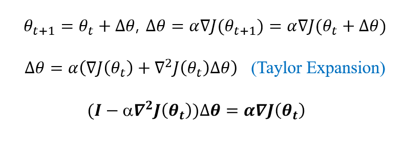
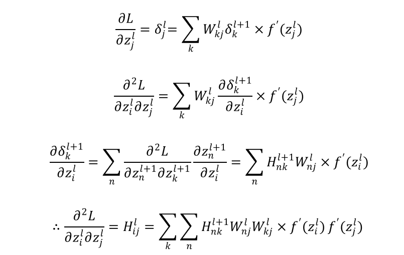
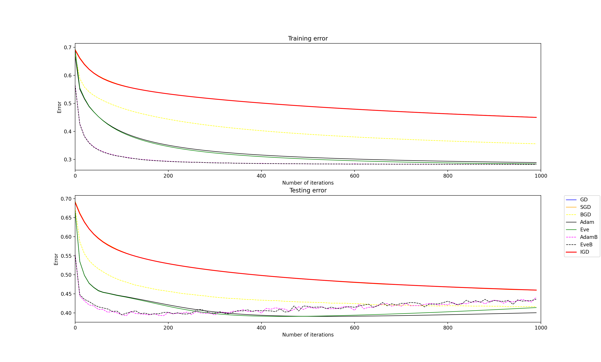
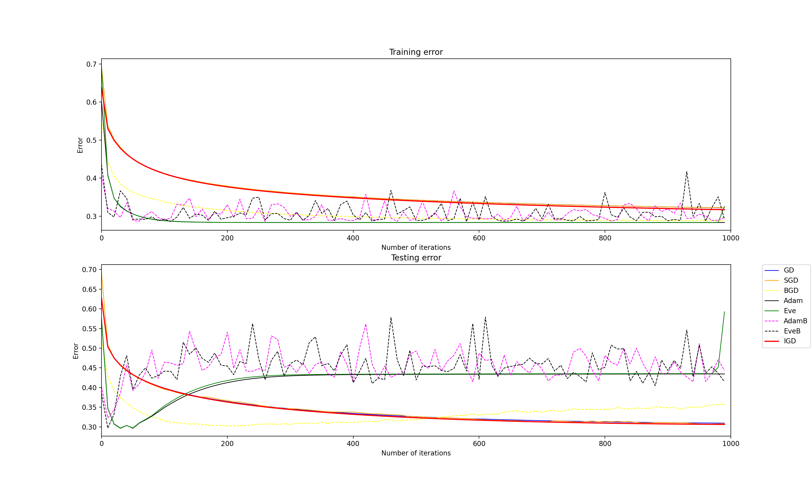
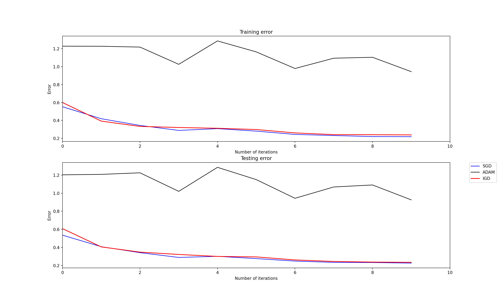
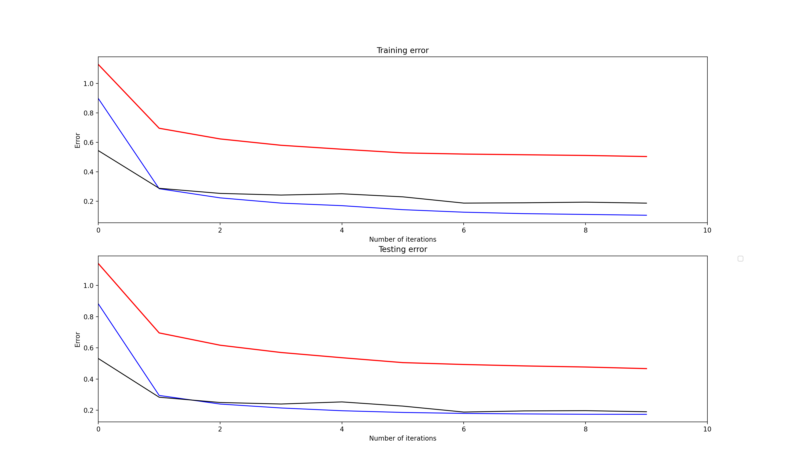
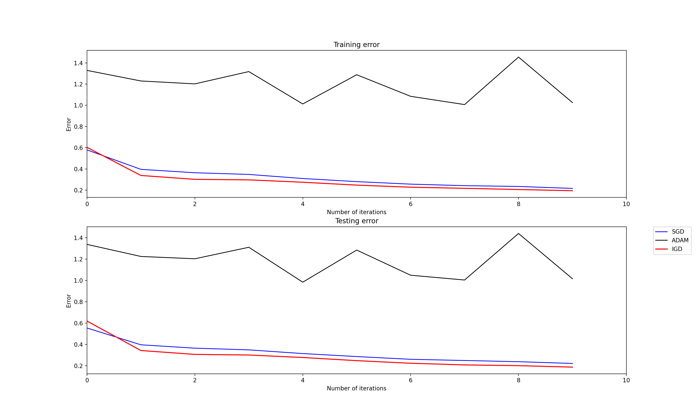

# Implicit Gradient Descent

Backward(Implicit) Euler method is known to be more effective for stiff systems than forward Euler method. Since each neurons in network recognizes certain shape of data better than others(especially for image data), the linear system in each layer can very likely be a stiff system. 

The equation that represents basic gradient descent resembles forward Euler method. Although the fundamentals for the two equations are very different, it was worth to test whether the advantages of backward Euler method can also be seen in gradient descent. 

## Overview

- Change equation of gradient descent into implicit form
- Discover back-propagation method for **implicit gradient descent**
- Test the results and compare it with other optimization techniques 

## Equations

### 1. Implicit Gradient Descent

    

Used conjugate gradient method to calculate difference. It requires back-propagation equations for the hessian matrices

### 2. Hessian

**1) Pre-actviation Values(Vector)**

    

**2) Weight Matrix**

    

## Results

- Used two networks. **Eve-master** and 2-layer fully connected network designed with numpy
- Used MNIST dataset for fully connected network
- Due to time complexity it was impossible to run the whole system with implicit gradient descent. Picked a few matrices and vectors to run with implicit form and the rest of the system was run with regular gradient descent

### 1. Eve-master

| learning rate = 0.01                                         | learning rate = 0.2                                          |
| ------------------------------------------------------------ | ------------------------------------------------------------ |
|  |  |

### 2. FC network, MNIST dataset

**1) Implicit gradient descent on b1, b2**

| learning rate = 0.01                                         | learning rate = 0.2                                          |
| ------------------------------------------------------------ | ------------------------------------------------------------ |
|  |  |

**2) Implicit gradient descent on b1, b2, w2**

| learning rate = 0.01                                         | learning rate = 0.2                                          |
| ------------------------------------------------------------ | ------------------------------------------------------------ |
|  |  |

Overall, it showed better performance that other optimization methods, when learning rate was relatively high. It is expected to be effective when the system becomes much more complex and the initial value of learning rate is set to large value. 

## Reference

[Eve-master](https://github.com/Jeanselme/Eve)